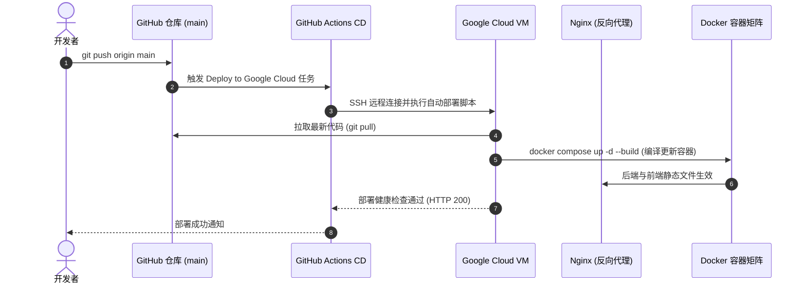

# 软考刷题系统 (Exam Quiz)

<div align="center">

[](#)
[](https://nestjs.com/)
[](https://vuejs.org/)
[](https://vitejs.dev/)
[](https://www.typescriptlang.org/)
[](https://www.docker.com/)
[](https://www.mysql.com/)
[](https://redis.io/)

面向全国计算机技术与软件专业技术资格（水平）考试（软考）的全流程数字化智能备考平台。  
覆盖软件设计师、网络工程师、系统集成项目管理工程师、信息系统项目管理师等科目，结合 **5大题型练习 + 艾宾浩斯遗忘曲线复习 + AI 智能出题/解析 + 全真模考与学情画像**，为考生提供高效沉浸的刷题备考体验。

[线上体验](#-线上体验) • [系统功能全景](#-系统功能全景) • [系统架构](#-系统架构) • [快速开始](#-快速开始) • [部署指南](#-部署与持续集成)

</div>

---

## 🌐 线上体验

| 站点端 | 访问地址 | 默认体验账号 / 说明 |
| :--- | :--- | :--- |
| **考生端 (移动端 H5)** | [https://quiz.wothat.com](https://quiz.wothat.com) | 支持手机浏览器直接访问、微信内打开体验，亦可在 PC 浏览器开启开发者模式 (F12) 切换手机视图浏览。可直接注册新账号或体验基础功能。 |
| **后台管理端 (Admin)** | [https://admin.wothat.com](https://admin.wothat.com) | 账号：`admin` &emsp; 密码：`admin123` |
| **Swagger 接口文档** | [https://quiz.wothat.com/api/docs](https://quiz.wothat.com/api/docs) | 交互式 RESTful API 在线文档与接口调试控制台 (支持 Bearer JWT 授权调试)。 |

---

## 🎯 系统定位与核心价值

- **专为软考设计**：深度适配软考考试大纲、分值结构与考察形式，支持多科目无缝切换与针对性冲刺。
- **5 大题型全覆盖**：打破传统刷题软件仅支持单选的限制，全面支持 **单选题、多选题、判断题、填空题、案例分析综合问答题**。
- **艾宾浩斯智能复习算法**：基于记忆遗忘周期（第 1、2、4、7、15 天）自动化追踪错题遗忘曲线，精准推送每日复习队列。
- **AI 智能赋能教学**：集成主流大语言模型能力，提供 **AI 考点智能出题、题目解析一键生成、考纲考点自动归纳**，极大降低教研成本。
- **全流程学情数据画像**：刷题量、正确率、知识雷达图、薄弱章节预警，备考短板一目了然。
- **商业化闭环支持**：内置「免费 + VIP会员」体系，支持月卡/季卡/年卡套餐管理与功能权益精细化隔离。

---

## 📱 系统功能全景

```
软考刷题系统
├── 考生端 (移动端 H5)
│   ├── 认证体系 (账号密码登录 / 极速注册 / 找回密码 / 个人资料)
│   ├── 备考看板 (科目切换 / 考试倒计时 / 刷题数据卡片 / 艾宾浩斯待复习提醒)
│   ├── 9大练习模式 (每日一练 / 章节练习 / 历年真题 / 全真模考 / 艾宾浩斯复习 / 案例分析 / 考点库 / 自主练习 / 错题巩固)
│   ├── 考场级做题引擎 (浮动答题卡 / 倒计时 / 题目标记 / 单题做题笔记 / 题目一键纠错)
│   ├── 成绩报告与深度解析 (分数计算 / 正确率 / 耗时分析 / 官方解析 / AI智能深度解析)
│   ├── 学情统计与画像 (刷题统计 / 掌握度雷达图 / 错题分布 / 做题历史回溯)
│   └── VIP 会员中心 (会员套餐购买 / 订单管理 / 权益说明)
│
└── 后台管理端 (Web Admin)
    ├── 运营仪表盘 (学员增长 / 今日刷题量 / 答题活跃度 / 待办工单与系统预警)
    ├── 题库中枢 (多维度题目检索 / 富文本公式配图编辑 / 题目查重 / 质量把控)
    ├── 题目智能导入 (Excel批量导入 / Word文档智能解析 / AI文本粘贴自动识别)
    ├── 考试与科目管理 (软考科目维护 / 章节多级树 / 知识点管理 / 试卷库与组卷规则)
    ├── AI 智能中心 (AI考点出题审核流水线 / Prompt提示词工程 / AI模型多供应商配置)
    ├── 纠错反馈中心 (考生错题工单审核 / 题目一键在线修正并通知反馈)
    ├── 学员与VIP运营 (学员档案 / 答题数据追踪 / 账号启禁用 / VIP套餐与订单管理)
    ├── 运营内容管理 (首页轮播 Banner / 备考公告发布与推送)
    └── 系统与安全设置 (多角色管理员 / 字典参数配置 / 邮件SMTP配置 / 操作审计日志)
```

### 1. 考生端（移动端 H5）功能矩阵

| 功能模块 | 功能特性描述 | 权限等级 |
| :--- | :--- | :---: |
| **备考看板** | • 软考科目无缝切换（软件设计师、网络工程师、高项等）<br>• 距离考试天数倒计时动态提醒<br>• 核心学情卡片：累计刷题量、做题正确率、科目总题库容量<br>• 艾宾浩斯待复习悬浮徽标，提醒考生今日遗忘节点 | 免费开放 |
| **每日一练** | • 每日自动生成 5 道核心考点题，支持做题打卡与每日习惯沉淀 | 基础免费 / VIP无限 |
| **章节练习** | • 严格依照软考官方大纲构建章节拓扑树<br>• 展示每章刷题进度条、已做题数与正确率，逐章击破知识盲区 | 免费开放 |
| **历年真题** | • 历年官方真题试卷全收录<br>• 支持「全真模拟模式（严格倒计时）」与「自由练习模式（即做即看解析）」 | 免费开放 |
| **全真模拟考试** | • 100% 还原真实考场题量、分值与交卷流程<br>• 智能计算得分，生成雷达图成绩单、错题明细与成绩趋势对比 | 免费限次 / VIP不限 |
| **艾宾浩斯复习** | • 结合记忆遗忘规律，自动将错题安排至第 1、2、4、7、15 天进行递进式复习<br>• 连续多次做对自动移出复习队列，对抗遗忘曲线 | VIP 专享 |
| **案例分析大题** | • 面向软考中高级主观题场景，展示背景材料、多小题作答输入区<br>• 提供采分点拆解、标准参考答案与评分要点对照 | VIP 专享 |
| **自主组卷练习** | • 支持按考点、章节、题型、难度自由组合，可勾选「只练错题」或「只练收藏题」<br>• 自定义抽题量，满足碎片化练习需求 | 免费开放 |
| **考场级答题引擎** | • 支持 5 种题型（单选/多选/判断/填空/案例分析）<br>• 底部滑出式答题卡（已答、未答、标记待复核状态一目了然）<br>• 单题即时笔记记录、收藏夹快速收录、题目错误一键反馈工单 | 免费开放 |
| **深度解析系统** | • 标准答案对比与考点精讲<br>• **AI 深度解析**：结合大语言模型针对该题进行解题思路拓展与知识点延伸 | 基础简版 / VIP深度 |
| **学情统计看板** | • 刷题数据走势图、答题正确率趋势、薄弱章节雷达分布图<br>• 历次做题历史记录与作答试卷回溯重温 | 免费/部分高级报表VIP |
| **会员与个人中心** | • 个人资料管理、每日学习提醒设置、备考目标管理<br>• VIP 会员中心：月度/季度/年度会员订阅、订单列表与权益说明 | 免费开放 |

### 2. 后台管理端（Web Admin）功能矩阵

| 功能模块 | 功能特性描述 |
| :--- | :--- |
| **运营大屏 (Dashboard)** | 汇总学员总数、累计做题数、今日新增学员、今日答题量、月度活跃度趋势图、待处理纠错工单待办提醒。 |
| **题库管理 (Question)** | • 支持按科目、章节、知识点、题型、难度、来源（手工/导入/AI）多维度筛选。<br>• 题目富文本编辑器，支持 Markdown、公式代码与题目插图。<br>• 题目状态流转（草稿、已发布、已下架、待审核）。<br>• 题目查重功能与正确率质量分析。 |
| **题目批量导入** | • **Excel 批量导入**：提供标准化模板下载，支持快速批量导入。<br>• **Word 文档解析**：智能提取题干、选项、答案与解析。<br>• **AI 文本智能识别**：随意粘贴纯文本试题，大模型自动结构化提取入库并支持导入前在线微调预览。 |
| **考试与科目管理 (Exam)** | • 软考科目配置（支持设置级别：初级/中级/高级）。<br>• 章节与考点树形层级管理，可挂载核心考点精讲与星级权重。<br>• 试卷管理：真题卷与模拟卷统一管理，支持设定总分、及格线、考试时长、试卷试题编排。 |
| **AI 智能中心 (AI)** | • **AI 考点智能出题**：选择科目与考点，指定题型和难度，一键批量生成高仿真考题。<br>• **出题人工审核流水线**：生成题目标记为待审核状态，教研人员在线校验、修改后一键入库发布。<br>• **Prompt 提示词模板**：可视化配置出题、解析生成等场景的 Prompt 模板与系统指令。<br>• **AI 模型供应商配置**：支持配置各大主流 LLM 接口协议（OpenAI 兼容协议、Gemini、DeepSeek 等），自定义 API Key、Base URL 与生成参数。 |
| **纠错工单中枢** | 集中展示考生在做题过程中上报的题干错字、答案存疑、解析错误等反馈；教研人员可一键跳转题目编辑并完成闭环处理。 |
| **学员与会员管理 (User)** | • 学员列表分页与精准搜索，查看学员累计刷题量、正确率、会员到期时间。<br>• 支持对异常账号进行封禁/解封、强制重置密码。<br>• VIP 套餐配置（自定义月卡/季卡/年卡价格与权益介绍），会员订单明细与状态追踪。 |
| **内容运营 (Content)** | • 移动端首页轮播图 (Banner) 上传、排序、跳转链接/路由配置。<br>• 系统公告与备考资讯的发布、置顶与启停管理。 |
| **系统管理 (System)** | • 管理员账号管理与密码修改。<br>• 系统基础参数字典配置。<br>• SMTP 邮件服务配置与测试发信（用于密码找回与通知）。<br>• 敏感业务操作审计日志（登录、题目修改、删除等操作留痕）。 |

---

## 🏗️ 系统架构

### 1. 总体技术架构

```mermaid
flowchart TB
    subgraph ClientLayer [客户端层]
        H5["📱 考生移动端 (Vue 3 + Vite + Vant 4)"]
        Admin["💻 运营后台 (Vue 3 + Vite + Element Plus)"]
    end

    subgraph GatewayLayer [接入与网关层]
        Nginx["🌐 Nginx (反向代理 / SSL / 静态资源路由)"]
    end

    subgraph ServiceLayer [后端服务层 (NestJS 10)]
        CoreApi["API 核心模块\n(Auth / User / Question / Exam / Quiz)"]
        QuizEngine["做题与评分引擎\n(判分 / 错题本 / 艾宾浩斯复习调度)"]
        AiService["AI 智能模块\n(LLM适配 / 提示词组装 / 考点智能出题 / 题目解析)"]
        ImportService["导入解析流水线\n(Excel批量 / Word解析 / AI文本识别)"]
    end

    subgraph StorageLayer [基础设施与数据层]
        MySQL[("🗄️ MySQL 8.0\n(业务核心数据/22张表)")]
        Redis[("⚡ Redis 7.x\n(Session/Token/刷题缓存/限流)")]
        RabbitMQ[("📨 RabbitMQ 3.x\n(异步AI生成/邮件/耗时任务)")]
        MinIO[("📦 MinIO / 对象存储\n(题目配图/导入文件)")]
    end

    ClientLayer --> Nginx
    Nginx --> ServiceLayer
    ServiceLayer --> StorageLayer
```

### 2. 技术选型清单

| 维度 | 技术栈 | 说明 |
| :--- | :--- | :--- |
| **后端框架** | NestJS 10 + TypeScript | 现代化企业级 Node.js 框架，模块化分层架构 |
| **ORM 框架** | TypeORM | 强类型数据映射，支持复杂关联查询与数据库迁移 |
| **接口规范** | RESTful + Swagger (OpenAPI 3.0) | 完善的接口契约与在线交互式调试文档 |
| **移动端前端** | Vue 3 + Vite + Pinia + Vant 4 | 专为移动端设计的组件库，轻量敏捷、极佳的交互触控体验 |
| **管理端前端** | Vue 3 + Vite + Pinia + Element Plus | 成熟的后台管理界面解决方案，丰富的表单与数据表格能力 |
| **图表组件** | ECharts 5 | 负责学情雷达图、做题走势图、运营大屏数据可视化 |
| **主数据库** | MySQL 8.0 | InnoDB 引擎，规范的 22 张实体关系设计（详见数据字典） |
| **高速缓存** | Redis 7 | JWT Token 鉴权校验、艾宾浩斯队列缓存、做题防重提交、API 限流 |
| **消息队列** | RabbitMQ 3 (Management) | 异步解耦 AI 智能出题任务、试卷导出、批量导入与邮件投递 |
| **对象存储** | MinIO (兼容 AWS S3 协议) | 存储考卷导入文件、题目配图、Banner 图片 |
| **网关与代理** | Nginx | 统一端口路由、静态前端资源托管、SSL 终止与安全防护 |
| **容器化与发布** | Docker + Docker Compose | 基础设施与应用容器化部署 |
| **持续集成/部署** | GitHub Actions + Google Cloud VM | main 分支推送自动执行 CI 构建与 SSH 远端生产部署 |

---

## 📂 项目工程目录

```
code/
├── backend/                       # NestJS 后端服务
│   ├── src/
│   │   ├── common/                # 通用模块 (守卫、拦截器、过滤器、装饰器)
│   │   ├── config/                # 环境变量与配置定义
│   │   ├── database/              # 数据库连接与 TypeORM 配置
│   │   ├── modules/               # 核心业务模块
│   │   │   ├── admin/             # 管理员与系统权限
│   │   │   ├── ai/                # AI 出题、解析生成与 Prompt 管理
│   │   │   ├── auth/              # JWT 鉴权、注册、登录、找回密码
│   │   │   ├── content/           # 公告与 Banner 运营管理
│   │   │   ├── exam/              # 软考科目、章节、知识点与试卷管理
│   │   │   ├── mail/              # Nodemailer 邮件发送服务
│   │   │   ├── question/          # 题库 CRUD、批量导入与纠错反馈
│   │   │   ├── quiz/              # 做题核心业务 (刷题/判分/艾宾浩斯/错题本)
│   │   │   ├── redis/             # Redis 缓存服务封装
│   │   │   ├── stats/             # 学情统计与后台运营大屏报表
│   │   │   ├── upload/            # 文件上传与 MinIO 对象存储交互
│   │   │   ├── user/              # 学员档案管理
│   │   │   └── vip/               # VIP 会员套餐与订单支付中心
│   │   └── main.ts                # 服务端启动入口与 Swagger 配置
│   ├── package.json
│   └── tsconfig.json
│
├── frontend-h5/                   # 移动端 H5 考生前台 (Vue 3 + Vant)
│   ├── src/
│   │   ├── api/                   # API 接口统一封装
│   │   ├── components/            # 通用组件 (答题卡/导航栏/倒计时/富文本题目)
│   │   ├── layouts/               # 移动端 TabBar 布局
│   │   ├── router/                # 路由配置 (含前置鉴权守卫)
│   │   ├── stores/                # Pinia 状态管理 (用户/做题中状态/主题)
│   │   ├── views/                 # 页面组件
│   │   │   ├── auth/              # 登录 / 注册 / 找回密码
│   │   │   ├── chapter/           # 章节练习列表
│   │   │   ├── home/              # 首页备考看板
│   │   │   ├── knowledge/         # 考点速查知识库
│   │   │   ├── mine/              # 我的主页
│   │   │   ├── practice/          # 每日一练/历年真题/全真模考/艾宾浩斯复习/案例分析
│   │   │   ├── quiz/              # 做题核心考场 (Quiz)、成绩报告 (Report)、解析 (Analysis)
│   │   │   ├── stats/             # 学情数据看板与雷达图
│   │   │   ├── subject/           # 软考科目切换选择器
│   │   │   ├── user/              # 笔记管理 / 收藏夹 / 历史记录 / 备考设置
│   │   │   ├── vip/               # 会员中心与订阅
│   │   │   └── wrong/             # 错题本中心
│   │   └── App.vue
│   └── vite.config.ts
│
├── frontend-admin/                # 后台管理端 (Vue 3 + Element Plus)
│   ├── src/
│   │   ├── api/                   # 后台 API 请求封装
│   │   ├── components/            # 富文本编辑器 / 题目预览组件
│   │   ├── layouts/               # Admin 后台侧边栏与头部布局
│   │   ├── router/                # 后台路由与动态权限管理
│   │   ├── stores/                # Pinia 状态
│   │   ├── views/
│   │   │   ├── ai/                # AI出题审核 / Prompt模板 / AI配置
│   │   │   ├── content/           # 备考公告 / 轮播 Banner
│   │   │   ├── dashboard/         # 运营仪表盘
│   │   │   ├── exam/              # 科目大纲 / 知识点 / 试卷管理
│   │   │   ├── question/          # 题库列表 / 导入中枢 / 纠错审核
│   │   │   ├── stats/             # 平台数据运营大屏
│   │   │   ├── system/            # 管理员 / 参数配置 / 审计日志
│   │   │   └── user/              # 学员管理 / VIP套餐设置
│   │   └── App.vue
│   └── vite.config.ts
│
├── docker/                        # 容器化与运维配置
│   ├── docker-compose.yml         # 本地开发基础设施一键编排 (MySQL/Redis/RabbitMQ/MinIO)
│   ├── docker-compose.prod.yml    # 生产环境一键编排
│   ├── Dockerfile.backend         # 后端生产镜像 Dockerfile
│   ├── Dockerfile.h5              # H5 生产镜像 Dockerfile
│   ├── Dockerfile.admin           # 管理端生产镜像 Dockerfile
│   ├── nginx/                     # Nginx 配置
│   │   ├── nginx.conf             # 主配置
│   │   ├── h5.conf                # H5 站点代理配置 (80)
│   │   └── admin.conf             # 管理端代理配置 (81)
│   └── mysql/init/                # MySQL 自动初始化脚本 (建表与种子数据)
├── .github/workflows/             # GitHub Actions CI/CD 自动化工作流
└── deploy/                        # 部署与运维辅助脚本
```

---

## 🚀 快速开始

### 运行环境准备

- **Node.js**: >= 20.0.0
- **Docker**: >= 20.10.0
- **Docker Compose**: >= 2.0.0
- **Git**

### 步骤 1：克隆仓库并启动本地基础设施

```bash
# 1. 进入代码仓库目录
cd code

# 2. 启动基础存储服务 (MySQL / Redis / RabbitMQ / MinIO)
cd docker
docker compose up -d

# 3. 检查容器运行状态
docker compose ps
```

基础设施默认映射端口及账密：

| 服务 | 本地访问端口 | 默认账号 / 密码 | 说明 |
| :--- | :--- | :--- | :--- |
| **MySQL** | `localhost:3306` | `root` / `root123` | 首次启动自动执行 `docker/mysql/init/*.sql` 初始化数据库 `exam_quiz` 与预设种子数据 |
| **Redis** | `localhost:6379` | 密码：`redis123` | 缓存与 Session 存储 |
| **RabbitMQ 控制台** | `http://localhost:15672` | `admin` / `admin123` | 异步消息队列监控面板 |
| **MinIO 控制台** | `http://localhost:9001` | `minio` / `minio123456` | 对象存储控制台 (API 端口为 9000) |

### 步骤 2：启动 NestJS 后端

```bash
cd ../backend

# 复制环境变量模板 (已配置好指向本地 docker 基础设施的默认参数)
cp .env.example .env

# 安装依赖
npm install

# 启动开发热重载服务
npm run start:dev
```
> 后端服务启动成功后，可在浏览器访问 `http://localhost:3000/api/docs` 查看 Swagger 在线接口文档。

### 步骤 3：启动考生端 (移动端 H5)

```bash
cd ../frontend-h5

# 安装依赖
npm install

# 启动开发服务器
npm run dev
```
> 访问 `http://localhost:5173`。建议在 Chrome / Edge 中按 `F12` 开启移动端设备模拟（推荐分辨率 iPhone 12/14/15 视口）以获取最佳视觉效果。

### 步骤 4：启动后台管理端 (Admin)

```bash
cd ../frontend-admin

# 安装依赖
npm install

# 启动开发服务器
npm run dev
```
> 访问 `http://localhost:5174`，使用初始账号登录：  
> **用户名**：`admin` &emsp; **密码**：`admin123`

---

## 🚢 部署与持续集成

项目配置了完整的 **Git 自动同步** 与 **Google Cloud 持续交付（CD）** 流水线：



### 生产环境域名路由分布

线上生产环境部署在 **Google Cloud VM**，由 Nginx 提供统一的反向代理与端口转发：

| 域名 | 指向服务 | 端口映射 |
| :--- | :--- | :--- |
| **`quiz.wothat.com`** | 考生端移动 H5 (静态部署) | 监听 80 端口，反代至容器 |
| **`admin.wothat.com`** | 后台管理系统 (静态部署) | 监听 80/81 端口，反代至容器 |
| **`quiz.wothat.com/api/*`** | 后端 API 接口 | 反向代理至 NestJS 3000 端口 |
| **`quiz.wothat.com/api/docs`** | Swagger 接口文档 | 反向代理至 NestJS Swagger 模块 |

---

## 🛠️ 常用开发与运维指令

```bash
# ==================== 基础设施容器 ====================
docker compose -f docker/docker-compose.yml up -d      # 后台启动中间件容器
docker compose -f docker/docker-compose.yml down       # 停止中间件容器 (保留数据卷)
docker compose -f docker/docker-compose.yml logs -f    # 实时查看容器日志

# ==================== 后端常用命令 ====================
cd backend
npm run build              # 生产构建编译
npm run lint               # ESLint 语法检查与格式校验
npm run test               # 运行单元测试

# ==================== 前端构建命令 ====================
cd frontend-h5 && npm run build       # 构建 H5 静态资源 (输出至 dist/)
cd frontend-admin && npm run build    # 构建 Admin 静态资源 (输出至 dist/)
```

---

## 📄 许可证 (License)

本项目属于私有软件系统 (Private Proprietary Software)，保留所有权利。未经官方授权，禁止任何形式的商业转售、镜像及二次分发。
